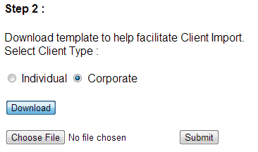
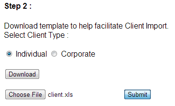

Data Import Tool
================

Generating Excel Templates and Importing Bulk Data - Using simple servlet and Apache POI.

Build Status
============

Travis

Setup Instructions
==================

1. Before you run the application, you need to have gradle installed and create a file dataimport.properties directly under your home directory. It should have the following 4 parameters:-

  mifos.endpoint=https://demo.openmf.org/mifosng-provider/api/v1/  
  mifos.user.id=mifos  
  mifos.password=password  
  mifos.tenant.id=default  

2. Use the command "gradle clean tomcatRunWar" to run the application and access it at localhost:8070/DataImportTool.

3. If you are hosting the data import tool in the cloud, you need to ssh into the system to create the dataimport.properties file.

Troubleshooting
===============

1. If you are hosting both this tool and the backend in the same system, you can change the debug port in gradlew.bat under mifosng-provider to listen in on a different port instead of 8005:-  set DEFAULT_JVM_OPTS=-Xdebug -Xrunjdwp:transport=dt_socket,address=8006,server=y,suspend=n

2. If you accidentally run out of heap size when running both in the same system, make sure your \_JAVA_OPTIONS in Environment variables is set to -Xms512m -Xmx512m -XX:MaxPermSize=512m and it is getting picked up by gradle.

Demo Import
===========

1. Download template.

   
   
2. Open the downloaded template.
   
   

3. Enter the required data.

   
   
4. Upload the entered data.

   
   
5. In case of erroneous entries in some rows.

   

6. See the error report, fix it and re-upload.

   

Workflow
========

After the tool gets up and running, here is a sample workflow :-

1. Enter your offices and staff through the UI provided with MifosX.
2. Import clients.
3. Import groups and meetings.
4. Enter your Currency Configuration, Funds, Charges, Loan Product configuration (Administration -> Organisation) and Payment Types (Administration -> System -> View Code ->Add/Edit Code Value) through the UI.
5. Import loans along with approval and disbursement information. For quick import of outstanding balances, enter the total amount repaid in this workbook or proceed to next step for maintaining complete repayment history.
6. (Optional) Import complete loan repayment history.
7. Enter your Savings Product configuration (Administration -> Organisation) through the UI.
8. Import savings accounts along with approval and activation information. For quick import of current balances of each savings account, enter the current balance as Minimum Required Opening Balance or proceed to next step to maintain complete transaction history.
9. (Optional) Import complete savings transaction history.

Limits
======

1. Default entries to fields in loan and savings import worksheets are set for the first 1000 rows. After that data validation rules still apply, but default filling of fields on selecting the product does not work.

2. The group import sheet format right now has a maximum upper limit of 100 clients per group.

3. Special characters in names (such as office name, client name, staff name, loan product name) will break the naming conventions used in Excel and no data can be entered which refers to these names.

4. In some cases, where the name itself starts with a number or special character, the template cannot be generated and results in a download error.

Endpoint Alert
==============

Changes in MifosX at these endpoints might directly affect the fuctionality of the tool:-

1. /offices
2. /staff
3. /clients
4. /loanproducts
5. /funds
6. /codes/12/codevalues
7. /loans
8. /loans/{loanId}?command=approve
9. /loans/{loanId}?command=disburse
10. /loans/{loanId}/transactions?command=repayment
11. /savingsproducts
12. /savingsaccounts
13. /savingsaccounts/{savingsId}?command=approve
14. /savingsaccounts/{savingsId}?command=activate
15. /savingsaccounts/{savingsId}/transactions?command={withdrawal/deposit}
16. /groups
17. /groups/{groupId}/calendars

Design
======

1. Import Class Diagram.

   

2. Sample Import Sequence Diagram.

   

3. Populator Class Diagram.

   

4. Sample Populate Sequence Diagram.

   

5. Populator DTOs diagram.

   

To Dos
======

1. Transaction support for group loans and group savings -> (Blocker) Can't find an endpoint which returns all loan accounts or all loan accounts associated with groups. /loans returns only individual loans.
2. Better workbook populator unit tests which will use FormulaEvaluator to evaluate if the data validation formulas and in-cell formulas embedded as Strings are not broken due to shifting of columns.
3. Minor improvements to group related features once the release is stable (like sync repayments with meetings).

Dev Setup
=========
1. Eclipsify using command gradle clean cleanEclipse eclipse
2. Import into project into workspace
When opened, in the package explorer of the java perspective, right-click import->General->Existing projects into workspace. In the dialog that opens, specify the root directory option by browsing to and selecting the DataImportTool directory.
